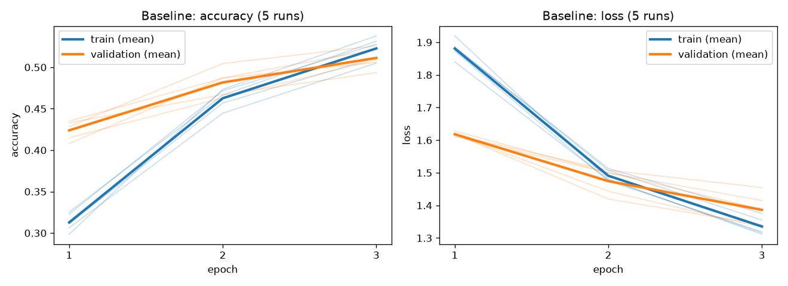
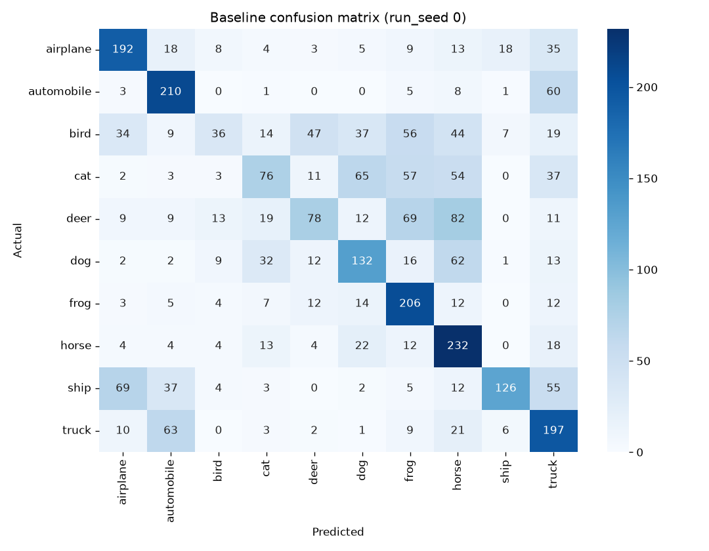
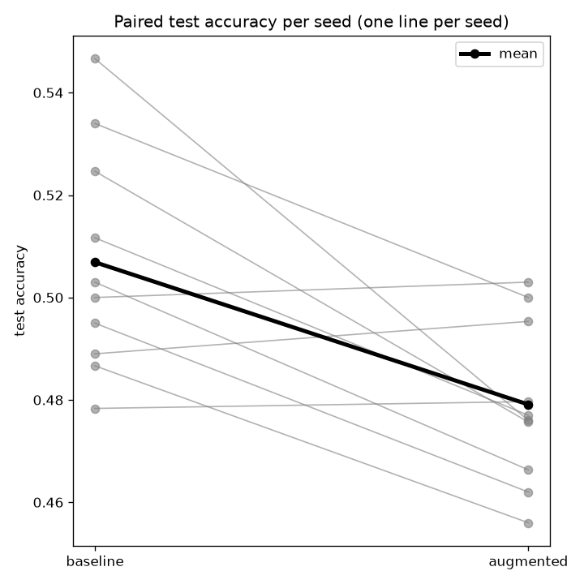
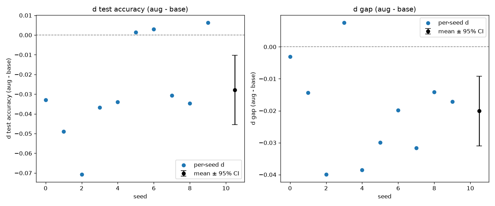
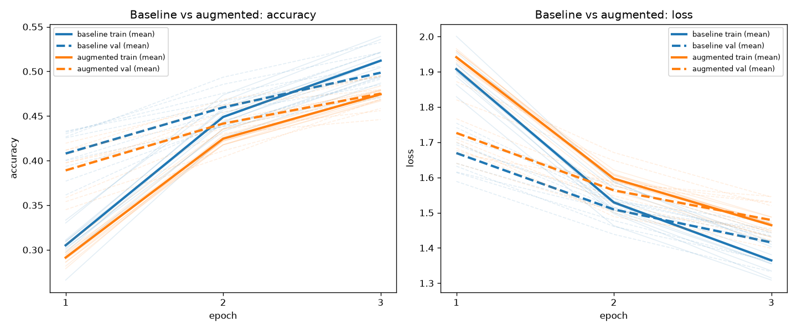
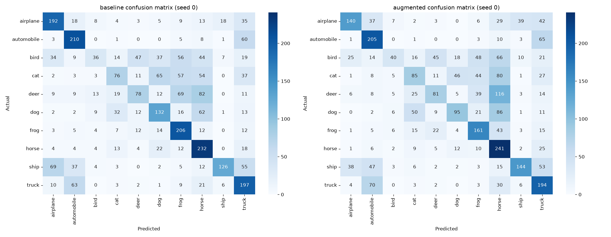

# CNN Project — Results Log

Living record of experimental results for the Group 1 CIFAR-10 augmentation study.
**Reported numbers are produced by the runner scripts; interpretations, conclusions, and
hypotheses are intentionally left blank for the team to fill in** (graded exercise /
pre-registration). Add findings under each **Observations** heading.

Source artifacts live in [`results/`](results/); regenerate with `baseline_runner.py`.

---

## 1. Baseline (no augmentation, no dropout)

_Status: complete • recorded 2026-08-01_

### Environment & settings
| Item | Value |
|---|---|
| TensorFlow | 2.21.0 |
| Device | CPU (native-Windows TF ≥ 2.11 exposes no GPU) |
| Data source | local `cifar-10-batches-py/` (byte-for-byte replica of the keras loader; no download) |
| Data seed | 42 (identical images across all runs) |
| Run seeds | [0, 1, 2, 3, 4] — only the weight-init / training seed varies |
| Splits | train 10000 / val 2000 / test 3000 |
| Classes | 10 |
| Model | Conv(32)→MaxPool→Conv(64)→MaxPool→Flatten→Dense(64)→Dropout(0.0)→Dense(10, softmax) |
| Optimizer / loss | adam / sparse_categorical_crossentropy |
| Epochs / batch | 3 / 64 |
| Params | 282,250 (all trainable) |
| oneDNN | enabled (TF default; minor float-ordering variation possible) |

### Per-run results (5 seeds)
| run_seed | test_acc | macro_P | macro_R | clean_train_acc | clean_val_acc | gap | sec |
|---:|---:|---:|---:|---:|---:|---:|---:|
| 0 | 0.4950 | 0.5089 | 0.4977 | 0.5274 | 0.4935 | 0.0339 | 11.50 |
| 1 | 0.5083 | 0.5253 | 0.5077 | 0.5504 | 0.5090 | 0.0414 | 9.26 |
| 2 | 0.5280 | 0.5316 | 0.5275 | 0.5960 | 0.5260 | 0.0700 | 8.24 |
| 3 | 0.5033 | 0.5338 | 0.5043 | 0.5567 | 0.5060 | 0.0507 | 6.57 |
| 4 | 0.5327 | 0.5440 | 0.5314 | 0.5784 | 0.5220 | 0.0564 | 4.23 |

Source: [`results/baseline_runs.csv`](results/baseline_runs.csv)

### Aggregate across the 5 runs (std = sample, ddof=1)
| metric | mean | std | min | max |
|---|---:|---:|---:|---:|
| test_accuracy | 0.5135 | 0.0162 | 0.4950 | 0.5327 |
| macro_precision | 0.5287 | 0.0130 | 0.5089 | 0.5440 |
| macro_recall | 0.5137 | 0.0149 | 0.4977 | 0.5314 |
| clean_train_acc | 0.5618 | 0.0264 | 0.5274 | 0.5960 |
| clean_val_acc | 0.5113 | 0.0130 | 0.4935 | 0.5260 |
| gap (train − val) | 0.0505 | 0.0139 | 0.0339 | 0.0700 |
| wall_clock_sec | 7.96 | 2.74 | 4.23 | 11.50 |

**Noise floor** (test_accuracy max − min) = **0.0377**

Source: [`results/baseline_summary.json`](results/baseline_summary.json)

### Per-class, mean across the 5 runs (ascending by recall)
| class | precision | recall | f1 | support |
|---|---:|---:|---:|---:|
| bird | 0.3829 | 0.3149 | 0.3278 | 303 |
| cat | 0.3835 | 0.3396 | 0.3505 | 308 |
| deer | 0.4695 | 0.3695 | 0.3991 | 302 |
| dog | 0.4798 | 0.4448 | 0.4450 | 281 |
| ship | 0.6660 | 0.5866 | 0.6113 | 313 |
| automobile | 0.6630 | 0.5875 | 0.6158 | 288 |
| horse | 0.5772 | 0.6013 | 0.5728 | 313 |
| airplane | 0.5835 | 0.6216 | 0.5949 | 305 |
| frog | 0.5715 | 0.6349 | 0.5903 | 275 |
| truck | 0.5101 | 0.6365 | 0.5592 | 312 |

Full per-run breakdown: [`results/baseline_per_class.csv`](results/baseline_per_class.csv) • per-epoch history: [`results/baseline_history.csv`](results/baseline_history.csv)

### Figures
Training vs. validation accuracy & loss (5 runs faded, mean bold):

Confusion matrix, run_seed 0:

### Observations — baseline
_(team to complete — numbers above are the evidence; write findings here)_
-

---

## 2. Paired baseline vs. augmented (Version 1, 10 seeds)

_Status: complete • recorded 2026-08-01 • pre-registered in [`HYPOTHESES_COMMITTED.md`](HYPOTHESES_COMMITTED.md), commit `fcd65bd` @ 2026-08-01T15:29:11-04:00 (before training)_

Design: two conditions (baseline / augmented = horizontal flip + `RandomRotation(0.05)` + `RandomZoom(0.10)`), seeds 0–9, **paired by seed**; both conditions seeded identically with `tf.random.set_seed(seed)`; identical data pipeline and `DATA_SEED=42`. Augmentation is active only during training; every accuracy used for the gap comes from `evaluate()` in inference mode (clean images, symmetric between conditions).

### Comparison (mean ± SD, 10 seeds)
| condition | test_accuracy | macro_precision | macro_recall | clean_train_acc | clean_val_acc | gap |
|---|---|---|---|---|---|---|
| baseline | 0.5069 ± 0.0221 | 0.5221 ± 0.0156 | 0.5080 ± 0.0215 | 0.5428 ± 0.0268 | 0.4986 ± 0.0211 | 0.0442 ± 0.0111 |
| augmented | 0.4791 ± 0.0159 | 0.4968 ± 0.0095 | 0.4808 ± 0.0166 | 0.4993 ± 0.0175 | 0.4752 ± 0.0175 | 0.0241 ± 0.0062 |

Source: [`results/comparison_table.csv`](results/comparison_table.csv), [`results/paired_runs.csv`](results/paired_runs.csv)

### Paired differences (augmented − baseline)
| outcome | mean d | SD | 95% CI | paired t (df=9) | Wilcoxon | Cohen's d | mean\|d\|/0.0377 |
|---|---:|---:|---|---|---|---:|---:|
| test accuracy *(two-sided)* | −0.0278 | 0.0246 | [−0.0454, −0.0102] | t=−3.5728, p=0.0060 | stat=6.0, p=0.0273 | −1.1298 | 0.794 |
| generalization gap *(one-tailed, H₁ d<0)* | −0.0201 | 0.0153 | [−0.0310, −0.0092] | t=−4.1639, p=0.0012 | stat=2.0, p=0.0029 | −1.3167 | 0.573 |

Per-seed differences (seeds 0–9):
- test accuracy: `−0.0330, −0.0490, −0.0707, −0.0367, −0.0340, 0.0013, 0.0030, −0.0307, −0.0347, 0.0063`
- gap: `−0.0031, −0.0144, −0.0399, 0.0076, −0.0385, −0.0299, −0.0198, −0.0317, −0.0141, −0.0171`

Source: [`results/paired_differences.csv`](results/paired_differences.csv), [`results/paired_stats.json`](results/paired_stats.json)

**Manipulation check** (`fit_final_train_acc`, each condition on its own training images): baseline 0.5120, augmented 0.4744, difference (aug − base) = −0.0376. Total wall clock 120.8s.

### Figures
Paired slope (per seed) and per-seed differences with 95% CI:

Learning curves (both conditions) and side-by-side confusion matrices (seed 0):

### Observations — paired experiment
_(team to complete — numbers above are the evidence; write findings here)_
-

---

## Change log
| Date | Change |
|---|---|
| 2026-08-01 | Baseline recorded (5 seeds); TF 2.21.0 / CPU. Commit adds `baseline_runner.py`, `results/`. |
| 2026-08-01 | Pre-registered hypotheses (Version 1) committed (`fcd65bd`) before the augmented run. |
| 2026-08-01 | Paired baseline-vs-augmented experiment recorded (10 seeds); adds `paired_experiment.py` + paired `results/` artifacts. |
| 2026-08-01 | Built + executed the graded submission notebook `Group01_CNN_ImageAugmentation/Group1_CNN_Image_Augmentation_FINAL.ipynb` (23 cells, outputs retained); §10–§13 render the committed run. |
